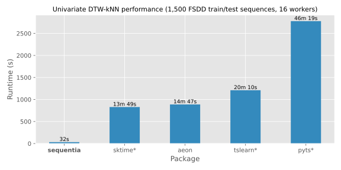

<p align="center">
  <h1 align="center">
    <br/>
    Sequentia
  </h1>
</p>

<p align="center">
  <em>Scikit-Learn compatible HMM and DTW based sequence machine learning algorithms in Python.</em>
</p>

<p align="center">
  <div align="center">
    <a href="https://pypi.org/project/sequentia">
      
    </a>
    <a href="https://pypi.org/project/sequentia">
      
    </a>
    <a href="https://sequentia.readthedocs.io/en/latest">
      
    </a>
    <a href="https://coveralls.io/github/eonu/sequentia">
      
    </a>
    <a href="https://raw.githubusercontent.com/eonu/sequentia/master/LICENSE">
      
    </a>
  </div>
</p>

<p align="center">
  <sup>
    <a href="#about">About</a> ·
    <a href="#build-status">Build Status</a> ·
    <a href="#features">Features</a> ·
    <a href="#installation">Installation</a> ·
    <a href="#documentation">Documentation</a> ·
    <a href="#examples">Examples</a> ·
    <a href="#acknowledgments">Acknowledgments</a> ·
    <a href="#references">References</a> ·
    <a href="#contributors">Contributors</a> ·
    <a href="#licensing">Licensing</a>
  </sup>
</p>

## About

Sequentia is a Python package that provides various classification and regression algorithms for sequential data, including methods based on hidden Markov models and dynamic time warping.

Some examples of how Sequentia can be used on sequence data include:

- determining a spoken word based on its audio signal or alternative representations such as MFCCs,
- predicting motion intent for gesture control from sEMG signals,
- classifying hand-written characters according to their pen-tip trajectories.

### Why Sequentia?

- **Simplicity and interpretability**: Sequentia offers a limited set of machine learning algorithms, chosen specifically to be more interpretable and easier to configure than more complex alternatives such as recurrent neural networks and transformers, while maintaining a high level of effectiveness.
- **Familiar and user-friendly**: To fit more seamlessly into the workflow of data science practitioners, Sequentia follows the ubiquitous Scikit-Learn API, providing a familiar model development process for many, as well as enabling wider access to the rapidly growing Scikit-Learn ecosystem.

## Build Status

| `master`                                                                                                                                                                                                 | `dev`                                                                                                                                                                                                      |
| -------------------------------------------------------------------------------------------------------------------------------------------------------------------------------------------------------- | ---------------------------------------------------------------------------------------------------------------------------------------------------------------------------------------------------------- |
| [](https://app.circleci.com/pipelines/github/eonu/sequentia?branch=master) | [](https://app.circleci.com/pipelines/github/eonu/sequentia?branch=master) |

## Features

### Models

#### [Dynamic Time Warping + k-Nearest Neighbors](https://sequentia.readthedocs.io/en/latest/sections/models/knn/index.html) (via [`dtaidistance`](https://github.com/wannesm/dtaidistance))

Dynamic Time Warping (DTW) is a distance measure that can be applied to two sequences of different length.
When used as a distance measure for the k-Nearest Neighbors (kNN) algorithm this results in a simple yet
effective inference algorithm.

- [x] Classification
- [x] Regression
- [x] Variable length sequences
- [x] Multivariate real-valued observations
- [x] Sakoe–Chiba band global warping constraint
- [x] Dependent and independent feature warping (DTWD/DTWI)
- [x] Custom distance-weighted predictions
- [x] Multi-processed predictions

#### [Hidden Markov Models](https://sequentia.readthedocs.io/en/latest/sections/models/hmm/index.html) (via [`hmmlearn`](https://github.com/hmmlearn/hmmlearn))

A Hidden Markov Model (HMM) is a state-based statistical model which represents a sequence as 
a series of observations that are emitted from a collection of latent hidden states which form
an underlying Markov chain. Each hidden state has an emission distribution that models its observations.

Expectation-maximization via the Baum-Welch algorithm (or forward-backward algorithm) [[1]](#references) is used to 
derive a maximum likelihood estimate of the Markov chain probabilities and emission distribution parameters 
based on the provided training sequence data.

- [x] Classification
- [x] Variable length sequences
- [x] Multivariate real-valued observations (modeled with Gaussian mixture emissions)
- [x] Univariate categorical observations (modeled with discrete emissions)
- [x] Linear, left-right and ergodic topologies
- [x] Multi-processed predictions

### Scikit-Learn compatibility

**Sequentia (≥2.0) is compatible with the Scikit-Learn API (≥1.4), enabling for rapid development and prototyping of sequential models.**

The integration relies on the use of [metadata routing](https://scikit-learn.org/stable/metadata_routing.html), 
which means that in most cases, the only necessary change is to add a `lengths` key-word argument to provide 
sequence length information, e.g. `fit(X, y, lengths=lengths)` instead of `fit(X, y)`.

### Similar libraries

As DTW k-nearest neighbors is the core algorithm offered by Sequentia, below is a comparison of the DTW k-nearest neighbors algorithm features supported by Sequentia and similar libraries.

||**`sequentia`**|[`aeon`](https://github.com/aeon-toolkit/aeon)|[`tslearn`](https://github.com/tslearn-team/tslearn)|[`sktime`](https://github.com/sktime/sktime)|[`pyts`](https://github.com/johannfaouzi/pyts)|
|-|:-:|:-:|:-:|:-:|:-:|
|Scikit-Learn compatible|✅|✅|✅|✅|✅|
|Multivariate sequences|✅|✅|✅|✅|❌|
|Variable length sequences|✅|✅|➖<sup>1</sup>|❌<sup>2</sup>|❌<sup>3</sup>|
|No padding required|✅|❌|➖<sup>1</sup>|❌<sup>2</sup>|❌<sup>3</sup>|
|Classification|✅|✅|✅|✅|✅|
|Regression|✅|✅|✅|✅|❌|
|Preprocessing|✅|✅|✅|✅|✅|
|Multiprocessing|✅|✅|✅|✅|✅|
|Custom weighting|✅|✅|✅|✅|✅|
|Sakoe-Chiba band constraint|✅|✅|✅|✅|✅|
|Itakura paralellogram constraint|❌|✅|✅|✅|✅|
|Dependent DTW (DTWD)|✅|✅|✅|✅|❌|
|Independent DTW (DTWI)|✅|❌|❌|❌|✅|
|Custom DTW measures|❌<sup>4</sup>|✅|❌|✅|✅|

- <sup>1</sup>`tslearn` supports variable length sequences with padding, but doesn't seem to mask the padding.
- <sup>2</sup>`sktime` does not support variable length sequences, so they are padded (and padding is not masked).
- <sup>3</sup>`pyts` does not support variable length sequences, so they are padded (and padding is not masked).
- <sup>4</sup>`sequentia` only supports [`dtaidistance`](https://github.com/wannesm/dtaidistance), which is one of the fastest DTW libraries as it is written in C.

### Benchmarks

To compare the above libraries in runtime performance on dynamic time warping k-nearest neighbors classification tasks, a simple benchmark was performed on a univariate sequence dataset.

The [Free Spoken Digit Dataset](https://sequentia.readthedocs.io/en/latest/sections/datasets/digits.html) was used for benchmarking and consists of:

- 3000 recordings of 10 spoken digits (0-9)
  - 50 recordings of each digit for each of 6 speakers
  - 1500 used for training, 1500 used for testing (split via label stratification)
- 13 features ([MFCCs](https://en.wikipedia.org/wiki/Mel-frequency_cepstrum))
  - Only the first feature was used as not all of the above libraries support multivariate sequences
- Sequence length statistics: (min 6, median 17, max 92)

Each result measures the total time taken to complete training and prediction repeated 10 times.

All of the above libraries support multiprocessing, and prediction was performed using 16 workers.

<sup>*</sup>: `sktime`, `tslearn` and `pyts` seem to not mask padding, which may result in incorrect predictions.



> **Device information**:
> - Product: ThinkPad T14s (Gen 6)
> - Processor: AMD Ryzen™ AI 7 PRO 360 (8 cores, 16 threads, 2-5GHz)
> - Memory: 64 GB LPDDR5X-7500MHz
> - Solid State Drive: 1 TB SSD M.2 2280 PCIe Gen4 Performance TLC Opal 
> - Operating system: Fedora Linux 41 (Workstation Edition)

## Installation

The latest stable version of Sequentia can be installed with the following command:

```console
pip install sequentia
```

### C libraries

For optimal performance when using any of the k-NN based models, it is important that the correct `dtaidistance` C libraries are accessible.

Please see the [`dtaidistance` installation guide](https://dtaidistance.readthedocs.io/en/latest/usage/installation.html) for troubleshooting if you run into C compilation issues, or if setting `use_c=True` on k-NN based models results in a warning.

You can use the following to check if the appropriate C libraries are available.

```python
from dtaidistance import dtw
dtw.try_import_c()
```

### Development

Please see the [contribution guidelines](/CONTRIBUTING.md) to see installation instructions for contributing to Sequentia.

## Documentation

Documentation for the package is available on [Read The Docs](https://sequentia.readthedocs.io/en/latest).

## Examples

Demonstration of classifying multivariate sequences into two classes using the `KNNClassifier`.

This example also shows a typical preprocessing workflow, as well as compatibility with 
Scikit-Learn for pipelining and hyper-parameter optimization.

---

First, we create some sample multivariate input data consisting of three sequences with two features.

- Sequentia expects sequences to be concatenated and represented as a single NumPy array.
- Sequence lengths are provided separately and used to decode the sequences when needed.

This avoids the need for complex structures such as lists of nested arrays with different lengths, 
or a 3D array with wasteful and annoying padding.

```python
import numpy as np

# Sequence data
X = np.array([
    # Sequence 1 - Length 3
    [1.2 , 7.91],
    [1.34, 6.6 ],
    [0.92, 8.08],
    # Sequence 2 - Length 5
    [2.11, 6.97],
    [1.83, 7.06],
    [1.54, 5.98],
    [0.86, 6.37],
    [1.21, 5.8 ],
    # Sequence 3 - Length 2
    [1.7 , 6.22],
    [2.01, 5.49],
])

# Sequence lengths
lengths = np.array([3, 5, 2])

# Sequence classes
y = np.array([0, 1, 1])
```

With this data, we can train a `KNNClassifier` and use it for prediction and scoring.

**Note**: Each of the `fit()`, `predict()` and `score()` methods require the sequence lengths 
to be provided in addition to the sequence data `X` and labels `y`.

```python
from sequentia.models import KNNClassifier

# Initialize and fit the classifier
clf = KNNClassifier(k=1)
clf.fit(X, y, lengths=lengths)

# Make predictions based on the provided sequences
y_pred = clf.predict(X, lengths=lengths)

# Make predicitons based on the provided sequences and calculate accuracy
acc = clf.score(X, y, lengths=lengths)
```

Alternatively, we can use [`sklearn.preprocessing.Pipeline`](https://scikit-learn.org/1.5/modules/generated/sklearn.pipeline.Pipeline.html) to build a more complex preprocessing pipeline:

1. Individually denoise each sequence by applying a [median filter](https://sequentia.readthedocs.io/en/latest/sections/preprocessing/transforms/filters.html#sequentia.preprocessing.transforms.median_filter) to each sequence.
2. Individually [standardize](https://scikit-learn.org/stable/modules/generated/sklearn.preprocessing.scale.html) each sequence by subtracting the mean and dividing the s.d. for each feature.
3. Reduce the dimensionality of the data to a single feature by using [PCA](https://scikit-learn.org/stable/modules/generated/sklearn.decomposition.PCA.html).
4. Pass the resulting transformed data into a `KNNClassifier`.

**Note**: Steps 1 and 2 use [`IndependentFunctionTransformer`](https://sequentia.readthedocs.io/en/latest/sections/preprocessing/transforms/function_transformer.html#sequentia.preprocessing.transforms.IndependentFunctionTransformer) provided by Sequentia to 
apply the specified transformation to each sequence in `X` individually, rather than using 
[`FunctionTransformer`](https://scikit-learn.org/stable/modules/generated/sklearn.preprocessing.FunctionTransformer.html#sklearn.preprocessing.FunctionTransformer) from Scikit-Learn which would transform the entire `X`
array once, treating it as a single sequence.

```python
from sklearn.preprocessing import scale
from sklearn.decomposition import PCA
from sklearn.pipeline import Pipeline

from sequentia.preprocessing import IndependentFunctionTransformer, median_filter

# Create a preprocessing pipeline that feeds into a KNNClassifier
pipeline = Pipeline([
    ('denoise', IndependentFunctionTransformer(median_filter)),
    ('scale', IndependentFunctionTransformer(scale)),
    ('pca', PCA(n_components=1)),
    ('knn', KNNClassifier(k=1))
])

# Fit the pipeline to the data
pipeline.fit(X, y, lengths=lengths)

# Predict classes for the sequences and calculate accuracy
y_pred = pipeline.predict(X, lengths=lengths)

# Make predicitons based on the provided sequences and calculate accuracy
acc = pipeline.score(X, y, lengths=lengths)
```

For hyper-parameter optimization, Sequentia provides a `sequentia.model_selection` sub-package
that includes most of the hyper-parameter search and cross-validation methods provided by 
[`sklearn.model_selection`](https://scikit-learn.org/stable/api/sklearn.model_selection.html), 
but adapted to work with sequences.

For instance, we can perform a grid search with k-fold cross-validation stratifying over labels
in order to find an optimal value for the number of neighbors in `KNNClassifier` for the 
above pipeline.

```python
from sequentia.model_selection import StratifiedKFold, GridSearchCV

# Define hyper-parameter search and specify cross-validation method
search = GridSearchCV(
    # Re-use the above pipeline
    estimator=Pipeline([
        ('denoise', IndependentFunctionTransformer(median_filter)),
        ('scale', IndependentFunctionTransformer(scale)),
        ('pca', PCA(n_components=1)),
        ('knn', KNNClassifier(k=1))
    ]),
    # Try a range of values of k
    param_grid={"knn__k": [1, 2, 3, 4, 5]},
    # Specify k-fold cross-validation with label stratification using 4 splits
    cv=StratifiedKFold(n_splits=4),
)

# Perform cross-validation over accuracy and retrieve the best model
search.fit(X, y, lengths=lengths)
clf = search.best_estimator_

# Make predicitons using the best model and calculate accuracy
acc = clf.score(X, y, lengths=lengths)
```

## Acknowledgments

In earlier versions of the package, an approximate DTW implementation [`fastdtw`](https://github.com/slaypni/fastdtw) was used in hopes of speeding up k-NN predictions, as the authors of the original FastDTW paper [[2]](#references) claim that approximated DTW alignments can be computed in linear memory and time, compared to the O(N<sup>2</sup>) runtime complexity of the usual exact DTW implementation.

I was contacted by [Prof. Eamonn Keogh](https://www.cs.ucr.edu/~eamonn/) whose work makes the surprising revelation that FastDTW is generally slower than the exact DTW algorithm that it approximates [[3]](#references). Upon switching from the `fastdtw` package to [`dtaidistance`](https://github.com/wannesm/dtaidistance) (a very solid implementation of exact DTW with fast pure C compiled functions), DTW k-NN prediction times were indeed reduced drastically.

I would like to thank Prof. Eamonn Keogh for directly reaching out to me regarding this finding.

## References

<table>
  <tbody>
    <tr>
      <td>[1]</td>
      <td>
        <a href=https://web.ece.ucsb.edu/Faculty/Rabiner/ece259/Reprints/tutorial%20on%20hmm%20and%20applications.pdf">Lawrence R. Rabiner. <b>"A Tutorial on Hidden Markov Models and Selected Applications in Speech Recognition"</b> <em>Proceedings of the IEEE 77 (1989)</em>, no. 2, 257-86.</a>
      </td>
    </tr>
    <tr>
      <td>[2]</td>
      <td>
        <a href="https://pdfs.semanticscholar.org/05a2/0cde15e172fc82f32774dd0cf4fe5827cad2.pdf">Stan Salvador & Philip Chan. <b>"FastDTW: Toward accurate dynamic time warping in linear time and space."</b> <em>Intelligent Data Analysis 11.5 (2007)</em>, 561-580.</a>
      </td>
    </tr>
    <tr>
      <td>[3]</td>
      <td>
        <a href="https://arxiv.org/ftp/arxiv/papers/2003/2003.11246.pdf">Renjie Wu & Eamonn J. Keogh. <b>"FastDTW is approximate and Generally Slower than the Algorithm it Approximates"</b> <em>IEEE Transactions on Knowledge and Data Engineering (2020)</em>, 1–1.</a>
      </td>
    </tr>
  </tbody>
</table>

## Contributors

All contributions to this repository are greatly appreciated. Contribution guidelines can be found [here](/CONTRIBUTING.md).

<table>
	<thead>
		<tr>
			<th align="center">
        <a href="https://github.com/eonu">
          
          <br/><sub><b>eonu</b></sub>
        </a>
			</th>
      <th align="center">
        <a href="https://github.com/Prhmma">
          
          <br/><sub><b>Prhmma</b></sub>
        </a>
			</th>
      <th align="center">
        <a href="https://github.com/manisci">
          
          <br/><sub><b>manisci</b></sub>
        </a>
      </th>
      <th align="center">
        <a href="https://github.com/jonnor">
          
          <br/><sub><b>jonnor</b></sub>
        </a>
      </th>
			<!-- Add more <th></th> blocks for more contributors -->
		</tr>
	</thead>
</table>

## Licensing

Sequentia is released under the [MIT](https://opensource.org/licenses/MIT) license.

Certain parts of source code are heavily adapted from [Scikit-Learn](scikit-learn.org/).
Such files contain a copy of [their license](https://github.com/scikit-learn/scikit-learn/blob/main/COPYING).

---

<p align="center">
  <b>Sequentia</b> &copy; 2019, Edwin Onuonga - Released under the <a href="https://opensource.org/licenses/MIT">MIT</a> license.<br/>
  <em>Authored and maintained by Edwin Onuonga.</em>
</p>
